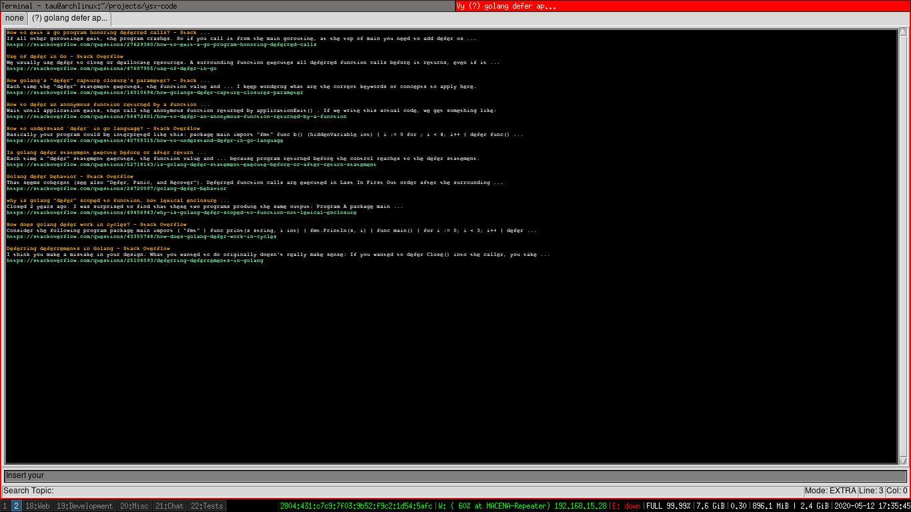
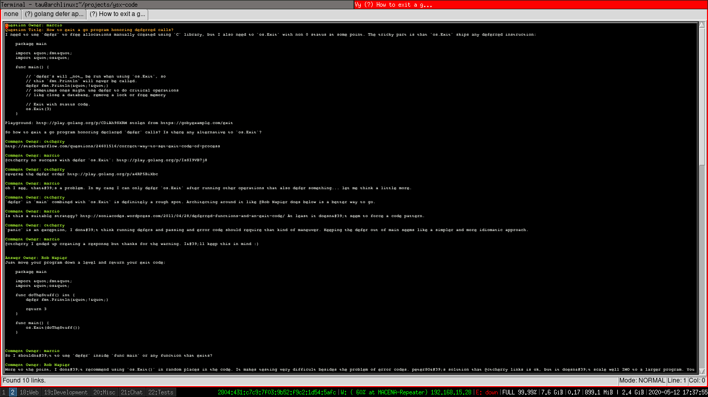

# StackSOS

A vy plugin to integrate with StackOverflow. 

# Install

StackSOS uses the Python package googler to perform searches on StackOverflow.

**See:** https://github.com/jarun/googler

~~~
pip install -r requirements.txt
pip install stacksos
~~~

Then add the statements below in your vyrc.

~~~python
from stacksos import StackSOS
autocall(StackSOS)
~~~

That is all.

# Usage

### Topic Search

The StackSOS plugin uses google to search for topics on StackOverflow.
In order to lookup a topic just press.

~~~
<Control-w>

In EXTRA mode. Insert your topic then press return. It will create a new tab
that contains all StackOverflow questions that are related to your inserted topic.

### Topic Inspection 

Place the cursor over the desired StackOverflow quesion link then press.

~~~
<Key-W>
~~~

In EXTRA mode. It will create a new tab where you can visualize the question.

